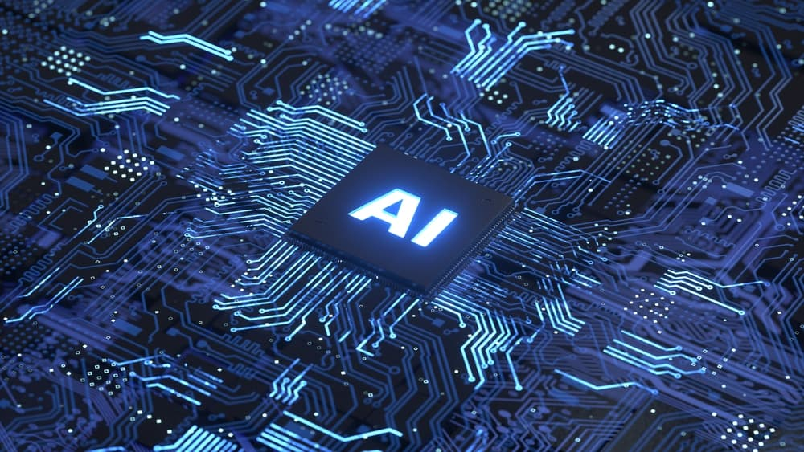

# Data Science and Artificial Intelligence
## By Micael Balza
### Specs, example and applications of data science and artificial intelligence using python.

The idea 

#### References

- :books: [Arian Tam. Deep Learning with PyTorch - Learn Basic Deep Learning with Minimal Code in PyTorch 2.0](https://machinelearningmastery.com/deep-learning-with-pytorch)
- :books: [Stefania Cristina, Mehreen Saeed. Building Transformer Models with Attention
Implementing a Neural Machine Translator from Scratch in Keras](https://machinelearningmastery.com/transformer-models-with-attention/)
- :books: [Daniel Voigt Godoy. Deep Learning with PyTorch - Step by Step A Beginner's Guide](https://leanpub.com/pytorch)
- :fist_right: [Dataquest Academic Program](https://www.dataquest.io/academic-program/)

**Artificial Neural Network (area da IA)**: Course Outline 
- Motivation, Syllabus, Calender, other issues.
- Introduciton to OpenAI API
    - **Recommendation systems (subarea)**: Using OpenAI to build recommendation systems that provide personalized recommendations based on user behavior and preferences.
    - **Integration with external data sources**: Combining OpenAI with external data sources like PDF documents to create more comprehensive and powerful AI models.
    - **Data visualization**: Visualizing the results of OpenAI models using charts, graphs, and other data visualization tools.
    - **Transcription and named entity recognition**: Using OpenAI to transcribe audio and video files, and extract named entities from the resulting text.
    - **Image generation**: Using OpenAI's image generation models to create custom images for a variety of applications.
    - Hands on chatGPT API 

**Week 02**: A little more about generative AI 
- Hands on Midjourney 

**Week 03**: Project 
